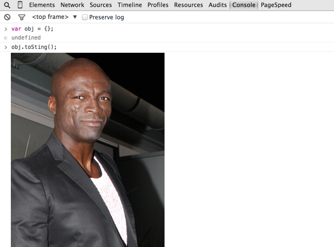

# Object.seal()

Extend `Object.prototype` with the method `seal()`, which logs an image of Seal to the development console.

Works at least on recent versions of Chrome.

## Image Credits

Eva Rinaldi, [CC BY-SA 2.0](http://creativecommons.org/licenses/by-sa/2.0/)

https://en.wikipedia.org/wiki/Seal_(musician)#/media/File:Seal_2012.jpg
